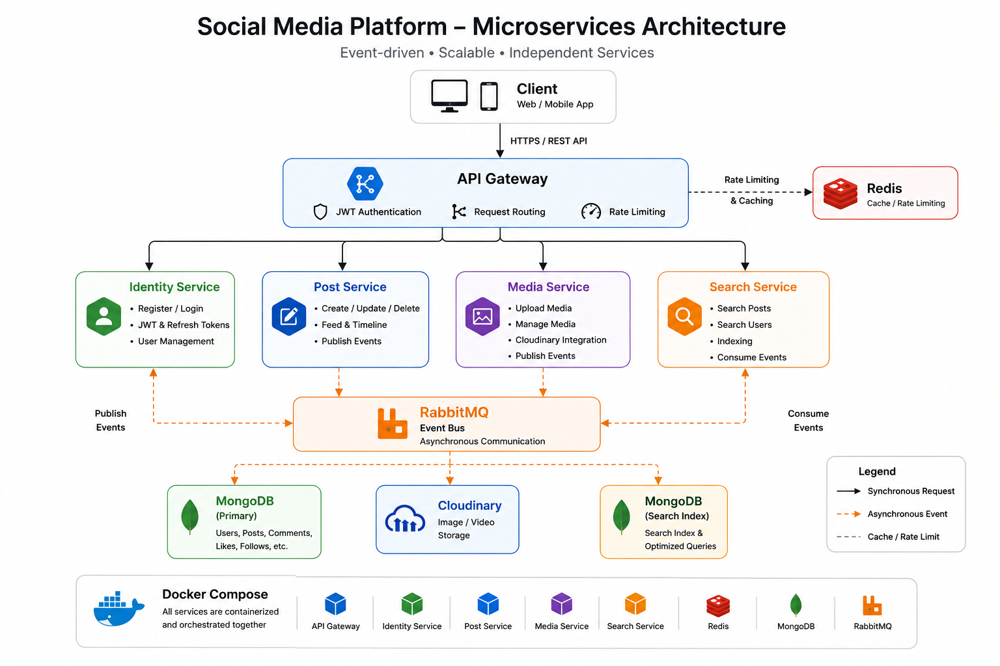

# 🌐 Social App

A production-inspired event-driven microservices application built with Node.js, Express, RabbitMQ, Redis, MongoDB and Docker.

The application demonstrates a distributed backend architecture where independent services communicate asynchronously through RabbitMQ. It includes centralized request routing with an API Gateway, JWT authentication, media management, search capabilities, and Redis-based rate limiting.


🏗️ Architecture



## ✨ Features

- JWT authentication
- API Gateway for centralized routing
- Independent microservices
- RabbitMQ event-driven communication
- Redis-based rate limiting
- Media uploads with Cloudinary
- Search service
- Dockerized development environment
- RESTful APIs

## 🛠 Tech Stack

- Node.js
- Express
- TypeScript

## 📦 Services

| Service | Responsibility |
|----------|----------------|
| API Gateway | Request routing, JWT validation and rate limiting |
| Identity Service | User authentication and authorization |
| Post Service | Post management and publishing events |
| Media Service | Image uploads and media management |
| Search Service | Search indexing and querying |


## 📦 Infrastructure

- Docker
- Docker Compose
- RabbitMQ
- Redis
- MongoDB
- Cloudinary

## 🚀 Highlights

This project focuses on distributed backend architecture and asynchronous communication.

Key implementation highlights include:

- Event-driven communication using RabbitMQ
- API Gateway for centralized routing and authentication
- Independent microservices with clear service boundaries
- Redis-powered request rate limiting
- Docker Compose orchestration for local development
- Cloudinary integration for media storage

## 🚀 Getting Started

Clone the repository

```bash
git clone https://github.com/ChrisAlex30/social-app.git
cd social-app
docker compose up --build
